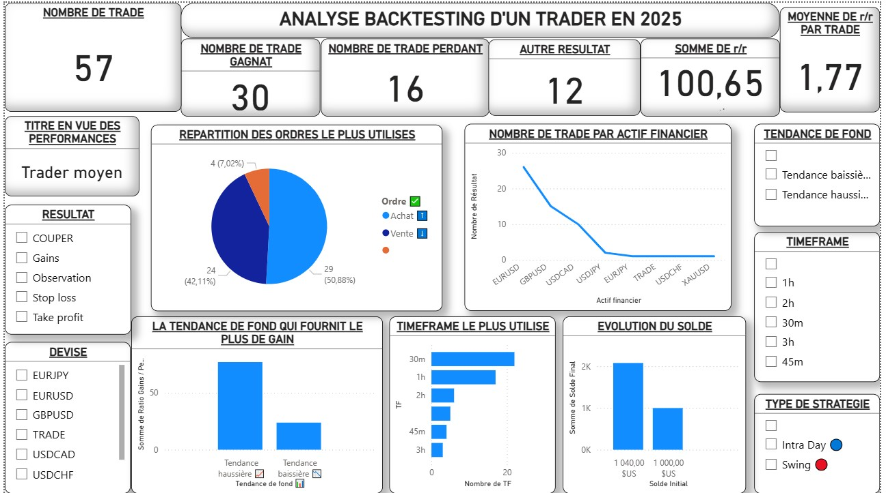
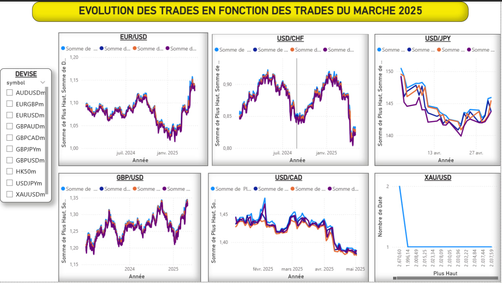

# ANALYSE-BACKTESTING
Ce projet vous permettra d'analyser vos performances de trading en visualisant votre progression sur les marchés et en comparant vos trades avec les mouvements du marché.

# 📊 Backtesting Trading - Analyse avec Power BI

Ce projet présente une analyse complète des performances de backtesting d’un trader via Power BI, en comparant ses prises de positions avec les données historiques du marché.

##  Objectifs
- Analyser les performances (winrate, drawdown, R:R)
- Identifier les tendances selon la paire et la date
- Évaluer la qualité des décisions de trading en fonction de l’évolution réelle du marché

##  Données utilisées
- **Fichiers de backtesting** fournis depuis Notion exportés en CSV
- **Données du marché** (Open, High, Low, Close) pour chaque paire tradée

##  Relations établies dans Power BI
- Jointure par `Date` entre les trades et les données de marché
- Analyse croisée selon les paires et résultats

##  Résultats clés
- Identification des bons/mauvais traders selon leur R:R
- Évolution du capital, drawdown, points d’entrée/sortie sur graphique marché

##  Utilisation
1. Télécharger les datasets dans le dossier 
2. Ouvrir le fichier `.pbix` dans Power BI Desktop

   ## 🖼️ Aperçu du projet

